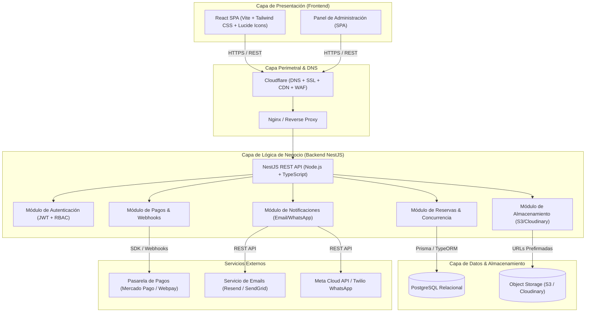
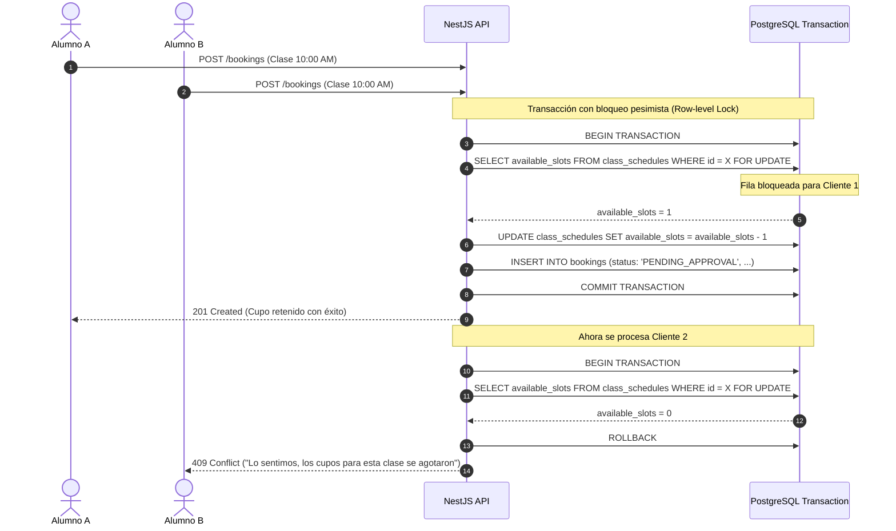
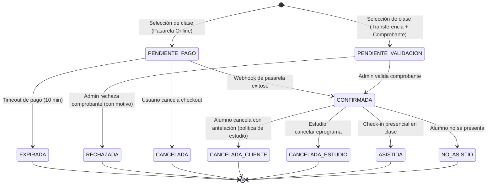

# 01. System Design Document (SDD) - Pilates Booking Platform

## 1. Visión General del Sistema

La **Plataforma de Agendamiento y Gestión para Clases de Pilates** es una aplicación web full-stack diseñada para optimizar y automatizar el ciclo completo de reservas de un centro o estudio de pilates. 

El sistema resuelve dos necesidades primordiales:
1. **Para el Alumno (Cliente):** Experiencia ágil y mobile-first para explorar horarios disponibles, reservar cupos en tiempo real y pagar de forma automatizada (pasarela de pagos online) o manual (transferencia bancaria con carga de comprobante).
2. **Para el Administrador / Instructor:** Panel centralizado para planificar clases, controlar aforo en tiempo real, auditar y validar comprobantes de transferencia bancaria, registrar asistencia y consultar métricas financieras.

---

## 2. Arquitectura de Software

La solución adopta una **Arquitectura en Capas y Desacoplada (Decoupled Client-Server Architecture)** basada en API RESTful, lo que permite escalabilidad independiente, facilidad de mantenimiento y un despliegue optimizado en la nube.

---

## 3. Modelo de Componentes (NestJS Backend)

El backend en **NestJS** sigue los principios de Modularidad, Inyección de Dependencias (DI) y Clean Architecture:

1. **`AuthModule`**:
   - Registro de usuarios, login con credenciales seguras (Argon2 / BCrypt).
   - Generación y verificación de tokens JWT (`AccessToken` en memoria / headers y `RefreshToken` en HttpOnly Cookie).
   - Guardias de autenticación (`JwtAuthGuard`) y de autorización (`RolesGuard`) para roles `CLIENT`, `INSTRUCTOR`, `ADMIN`.

2. **`ClassesModule` & `SchedulesModule`**:
   - Tipos de clase (Reformer, Mat, Cadillacs, Duo, Privadas).
   - Programación de bloques horarios (sesiones fijas o recurrentes).
   - Control de aforo máximo y cupos dinámicos.

3. **`BookingsModule`**:
   - Motor central de reservas.
   - Manejo de estados de la reserva mediante una máquina de estados determinista.
   - Prevención de sobrecupos (*Double-Booking / Overbooking prevention*) mediante transacciones ACID y bloqueos a nivel de fila (`SELECT ... FOR UPDATE`).

4. **`PaymentsModule`**:
   - Integración con pasarelas online (Mercado Pago / Webpay / Stripe) para pagos con tarjeta de débito/crédito.
   - Flujo manual: Registro de pagos por transferencia bancaria y enlace del archivo del comprobante.
   - Gestión de webhooks idempotentes para procesar callbacks de pago sin duplicidad.

5. **`StorageModule`**:
   - Carga segura de comprobantes de pago (PDF, PNG, JPG).
   - Generación de *Presigned URLs* para subida directa desde el frontend o almacenamiento seguro con aislamiento por inquilino/usuario.

6. **`NotificationsModule`**:
   - Cola de eventos o servicios asíncronos para el envío de correos transaccionales (confirmación de reserva, notificación de revisión de transferencia, rechazo con feedback).
   - Integración opcional de alertas por WhatsApp.

---

## 4. Estrategia de Concurrencia y Control de Sobrecupos (Anti-Overbooking)

Un desafío crítico en estudios de pilates son los cupos físicos estrictos (generalmente entre 6 y 10 máquinas/camas reformer). Si dos alumnos intentan reservar el último cupo en el mismo segundo:

- **Mecanismo:** `SELECT ... FOR UPDATE` en PostgreSQL garantiza que la lectura del cupo y su decremento sean atómicos dentro de la misma transacción de base de datos.
- **TTL de Reserva Provisional (Soft Lock):** Cuando el usuario va a pagar con pasarela, el cupo se reserva en estado `PENDIENTE_PAGO` con un temporizador (ej. 10 minutos). Si el pago no se completa antes del vencimiento, un cron job de NestJS (`@nestjs/schedule`) libera el cupo automáticamente y marca la reserva como `EXPIRADA`.

---

## 5. Máquina de Estados de la Reserva

Cada reserva sigue un ciclo de vida riguroso:

---

## 6. Seguridad y Resiliencia

1. **Autenticación & Autorización:**
   - Hashing de contraseñas con Argon2id o BCrypt (salt rounds 12).
   - JSON Web Tokens (JWT) con rotación y expiración corta (15 min para Access Token, 7 días para Refresh Token).
   - Control de acceso por roles (RBAC) validado en cada endpoint con decoradores NestJS `@Roles('ADMIN')`.
2. **Validación de Entradas:**
   - `ValidationPipe` global en NestJS con `class-validator` y `class-transformer` (whitelist: true, forbidNonWhitelisted: true).
3. **Carga Segura de Archivos:**
   - Validación rigurosa de MIME type en el servidor (únicamente `image/jpeg`, `image/png`, `application/pdf`).
   - Límite de peso máximo (5 MB por comprobante).
   - Sanitización del nombre de archivo (uso de UUIDv4 como clave en el bucket de almacenamiento).
4. **Protección Perimetral:**
   - Helmet para cabeceras HTTP seguras.
   - CORS restrictivo por entorno (whitelist de dominios de desarrollo, staging y producción).
   - Rate limiting global mediante `@nestjs/throttler` (ej. máximo 100 requests por minuto por IP, 5 intentos para login).
