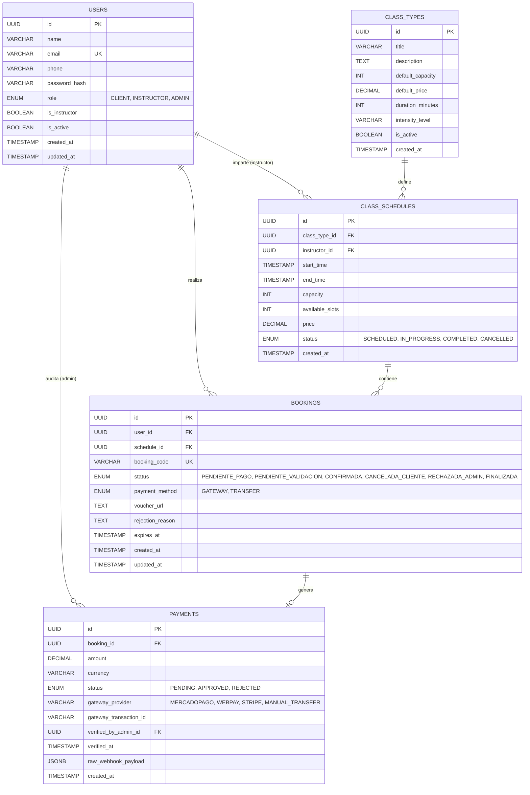

# 04. Especificaciones Técnicas & Arquitectura de Datos

## 1. Stack Tecnológico Detallado

| Capa / Módulo | Tecnología Seleccionada | Justificación Técnica |
| :--- | :--- | :--- |
| **Backend Framework** | **NestJS 10+ (Node.js + TypeScript)** | Arquitectura modular robusta, inyección de dependencias nativa, validación declarativa con DTOs, tipado estricto y escalabilidad empresarial. |
| **ORM / Data Access** | **Prisma ORM** | Type-safety de extremo a extremo, migraciones declarativas y deterministas, transacciones ACID nativas (`prisma.$transaction`) con soporte para bloqueos de fila. |
| **Base de Datos** | **PostgreSQL 16** | Robustez relacional, soporte nativo de UUID, índices parciales y B-tree, alto rendimiento con transacciones concurrentes. |
| **Frontend Framework** | **React 18 / 19 + Vite (TypeScript)** | Compilaciones ultrarrápidas, separación limpia del backend, consumo eficiente de API REST y renderizado óptimo para SPAs con panel administrativo. |
| **Diseño & UI Kit** | **Tailwind CSS v3/v4 + Radix UI / shadcn/ui** | Cero sobrecarga de runtime, diseño responsive adaptado a estética wellness, componentes accesibles (WAI-ARIA) listos para producción. |
| **Gestión de Estado & Cache** | **TanStack Query (React Query)** | Sincronización automática con el servidor, revalidación en segundo plano, mutaciones optimistas y manejo de caché sin boilerplate. |
| **Almacenamiento de Archivos** | **S3-Compatible (Cloudinary / AWS S3 / Supabase Storage)** | URLs prefirmadas para subida y lectura segura de comprobantes de pago; MinIO para entorno de desarrollo local en Docker. |
| **Autenticación** | **Passport.js + JWT (JSON Web Tokens)** | Access token de corta duración en encabezados y Refresh token seguro; hashing con Argon2id. |
| **Emails Transaccionales** | **Resend (Node SDK)** | Alta tasa de entregabilidad, soporte para plantillas HTML responsivas y facilidad de integración en entornos cloud. |

---

## 2. Modelo Entidad-Relación (ERD)



---

## 3. Esquema Prisma (`schema.prisma`)

```prisma
datasource db {
  provider = "postgresql"
  url      = env("DATABASE_URL")
}

generator client {
  provider = "prisma-client-js"
}

enum Role {
  CLIENT
  INSTRUCTOR
  ADMIN
}

enum ScheduleStatus {
  SCHEDULED
  IN_PROGRESS
  COMPLETED
  CANCELLED
}

enum BookingStatus {
  PENDIENTE_PAGO
  PENDIENTE_VALIDACION
  CONFIRMADA
  CANCELADA_CLIENTE
  RECHAZADA_ADMIN
  FINALIZADA
}

enum PaymentMethod {
  GATEWAY
  TRANSFER
}

enum PaymentStatus {
  PENDING
  APPROVED
  REJECTED
}

model User {
  id            String          @id @default(uuid())
  name          String          @db.VarChar(150)
  email         String          @unique @db.VarChar(150)
  phone         String          @db.VarChar(30)
  passwordHash  String          @map("password_hash") @db.VarChar(255)
  role          Role            @default(CLIENT)
  isInstructor  Boolean         @default(false) @map("is_instructor")
  isActive      Boolean         @default(true) @map("is_active")
  createdAt     DateTime        @default(now()) @map("created_at")
  updatedAt     DateTime        @updatedAt @map("updated_at")

  bookings          Booking[]
  taughtSchedules   ClassSchedule[] @relation("InstructorSchedules")
  auditedPayments   Payment[]       @relation("AdminVerifiedPayments")

  @@map("users")
}

model ClassType {
  id              String          @id @default(uuid())
  title           String          @db.VarChar(100)
  description     String?         @db.Text
  defaultCapacity Int             @default(8) @map("default_capacity")
  defaultPrice    Decimal         @map("default_price") @db.Decimal(10, 2)
  durationMinutes Int             @default(60) @map("duration_minutes")
  intensityLevel  String          @default("Todos los niveles") @map("intensity_level") @db.VarChar(50)
  isActive        Boolean         @default(true) @map("is_active")
  createdAt       DateTime        @default(now()) @map("created_at")

  schedules       ClassSchedule[]

  @@map("class_types")
}

model ClassSchedule {
  id             String         @id @default(uuid())
  classTypeId    String         @map("class_type_id")
  instructorId   String?        @map("instructor_id")
  startTime      DateTime       @map("start_time")
  endTime        DateTime       @map("end_time")
  capacity       Int            @default(8)
  availableSlots Int            @map("available_slots")
  price          Decimal        @db.Decimal(10, 2)
  status         ScheduleStatus @default(SCHEDULED)
  createdAt      DateTime       @default(now()) @map("created_at")

  classType      ClassType      @relation(fields: [classTypeId], references: [id])
  instructor     User?          @relation("InstructorSchedules", fields: [instructorId], references: [id])
  bookings       Booking[]

  @@index([startTime, status])
  @@map("class_schedules")
}

model Booking {
  id              String         @id @default(uuid())
  userId          String         @map("user_id")
  scheduleId      String         @map("schedule_id")
  bookingCode     String         @unique @map("booking_code") @db.VarChar(20)
  status          BookingStatus  @default(PENDIENTE_PAGO)
  paymentMethod   PaymentMethod  @map("payment_method")
  voucherUrl      String?        @map("voucher_url") @db.Text
  rejectionReason String?        @map("rejection_reason") @db.Text
  expiresAt       DateTime?      @map("expires_at")
  createdAt       DateTime       @default(now()) @map("created_at")
  updatedAt       DateTime       @updatedAt @map("updated_at")

  user            User           @relation(fields: [userId], references: [id])
  schedule        ClassSchedule  @relation(fields: [scheduleId], references: [id])
  payment         Payment?

  @@index([userId, status])
  @@index([scheduleId])
  @@map("bookings")
}

model Payment {
  id                   String        @id @default(uuid())
  bookingId            String        @unique @map("booking_id")
  amount               Decimal       @db.Decimal(10, 2)
  currency             String        @default("CLP") @db.VarChar(10)
  status               PaymentStatus @default(PENDING)
  gatewayProvider      String        @map("gateway_provider") @db.VarChar(50)
  gatewayTransactionId String?       @map("gateway_transaction_id") @db.VarChar(100)
  verifiedByAdminId    String?       @map("verified_by_admin_id")
  verifiedAt           DateTime?     @map("verified_at")
  rawWebhookPayload    Json?         @map("raw_webhook_payload")
  createdAt            DateTime      @default(now()) @map("created_at")

  booking              Booking       @relation(fields: [bookingId], references: [id], onDelete: Cascade)
  verifiedByAdmin      User?         @relation("AdminVerifiedPayments", fields: [verifiedByAdminId], references: [id])

  @@map("payments")
}
```

---

## 4. Diseño de la API REST (Endpoints Clave)

### 4.1. Autenticación (`/api/v1/auth`)
- `POST /register`: Registro de cliente (nombre, email, teléfono, password).
- `POST /login`: Validación de credenciales y retorno de Access Token + Cookie con Refresh Token.
- `POST /refresh`: Renovación transparente del token de sesión.
- `GET /me`: Obtención de datos y rol del usuario autenticado.

### 4.2. Horarios y Clases (`/api/v1/schedules`)
- `GET /`: Listar horarios disponibles con filtros (`date_from`, `date_to`, `class_type_id`, `instructor_id`).
- `GET /:id`: Detalle de una sesión (cupos disponibles, instructor, política).
- `POST /` *(Admin)*: Crear una nueva sesión programada.
- `POST /bulk-generate` *(Admin)*: Generador recurrente de sesiones para el mes.
- `PATCH /:id/cancel` *(Admin)*: Cancelar sesión con aviso automático a los inscritos.

### 4.3. Reservas (`/api/v1/bookings`)
- `POST /`: Crear reserva provisional.
  - Body: `{ scheduleId: string, paymentMethod: 'GATEWAY' | 'TRANSFER', voucherUrl?: string }`.
  - Si es `TRANSFER`: el comprobante debe adjuntarse o haberse cargado previamente; la reserva queda en `PENDIENTE_VALIDACION`.
  - Si es `GATEWAY`: se genera una sesión de pago y la reserva queda en `PENDIENTE_PAGO` con TTL de 10 min.
- `GET /my-bookings`: Listado de reservas del alumno autenticado.
- `PATCH /:id/cancel`: Cancelación voluntaria del alumno (valida política de 12 horas).

### 4.4. Auditoría y Comprobantes *(Solo Admin)* (`/api/v1/admin/bookings`)
- `GET /pending-vouchers`: Bandeja de entrada con comprobantes pendientes de revisión.
- `PATCH /:id/approve-voucher`: Aprueba el pago por transferencia. Cambia estado a `CONFIRMADA` y dispara notificación.
- `PATCH /:id/reject-voucher`: Rechaza la transferencia. Libera el cupo inmediatamente. Body: `{ reason: string }`.

### 4.5. Almacenamiento Seguro (`/api/v1/storage`)
- `POST /upload-voucher`: Endpoint con interceptor `FileInterceptor` para subir archivo a S3/Cloudinary/MinIO.
- Retorna URL segura del recurso o identificador del objeto.

### 4.6. Webhooks de Pasarelas (`/api/v1/webhooks`)
- `POST /mercadopago`: Recepción de IPN / Webhook de Mercado Pago.
- `POST /webpay`: Retorno y confirmación de transacción Webpay Plus.
