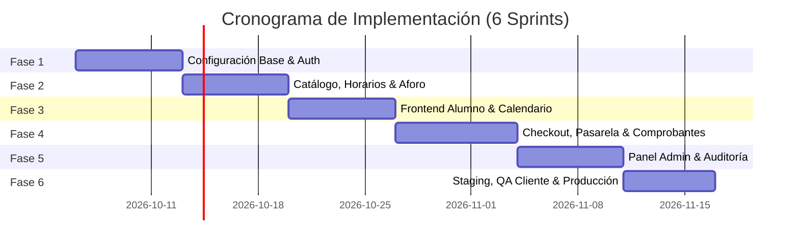

# 05. Plan de Desarrollo, DevOps & Estrategia Multi-Entorno Cloud

## 1. Estrategia de Entornos (Dev, Staging, Prod)

Para garantizar estabilidad, entregas continuas y una experiencia de validación sin riesgos para el cliente, se establece una arquitectura de tres entornos completamente aislados:

```mermaid
flowchart LR
    subgraph Local_Dev ["1. Entorno de Desarrollo (Local)"]
        DockerDev["Docker Compose\n(NestJS Dev + Vite React + Postgres + MinIO)"]
        LocalEnv[".env.development"]
    end

    subgraph Staging_Env ["2. Entorno de Pruebas (Staging / Demo Cliente)"]
        FrontStaging["Front: staging.tudominio.com\n(Vercel / Cloudflare Pages)"]
        APIStaging["API: api-staging.tudominio.com\n(Railway / Docker Staging)"]
        DBStaging[("PostgreSQL Staging\n(Datos Demo + Sandbox)")]
        GatewaySandbox["Pasarela: Modo SANDBOX / TEST"]
    end

    subgraph Prod_Env ["3. Entorno de Producción"]
        FrontProd["Front: tudominio.com\n(Vercel / CDN Global)"]
        APIProd["API: api.tudominio.com\n(Railway / VPS Docker)"]
        DBProd[("PostgreSQL Producción\n(Backups automáticos diarios)")]
        GatewayLive["Pasarela: Modo LIVE (Dinero Real)"]
    end

    Local_Dev -->|Pull Request a 'staging'| Staging_Env
    Staging_Env -->|Aprobación del Cliente & Merge a 'main'| Prod_Env
```

---

### 1.1. Matriz Comparativa de Entornos

| Característica | 1. Desarrollo (Local) | 2. Pruebas / Staging (Cliente & QA) | 3. Producción |
| :--- | :--- | :--- | :--- |
| **Propósito** | Programación diaria, debugging rápido y pruebas unitarias. | Demostración interactiva para el cliente, pruebas de aceptación (UAT). | Operación real del estudio de pilates y transacciones monetarias. |
| **URL de Acceso** | `localhost:3000` (Front) / `localhost:4000` (API) | `https://staging.tudominio.com` o preview de Vercel/Railway. | `https://tudominio.com` y `https://api.tudominio.com`. |
| **Base de Datos** | PostgreSQL en contenedor Docker local. | PostgreSQL Cloud aislado con datos ficticios (seeders). | PostgreSQL Cloud de alta disponibilidad con copias de seguridad. |
| **Pasarela de Pagos** | Mock local o Sandbox con tarjetas de prueba. | **Sandbox Oficial** (Mercado Pago / Webpay Test). | **Producción Live** con credenciales de recaudación real. |
| **Almacenamiento Comprobantes** | MinIO (S3 local en Docker) o bucket de pruebas. | Bucket S3 / Cloudinary de pruebas (`pilates-staging`). | Bucket S3 / Cloudinary blindado (`pilates-prod`). |
| **Emails & WhatsApp** | Consola o Mailhog / Ethereal Email. | Resend con prefijo `[STAGING]` en el asunto del correo. | Resend / Meta API oficial con dominio autenticado (DKIM/SPF). |
| **Acceso para el Cliente** | No disponible para el cliente. | Credenciales demo entregadas al cliente (Admin y Alumno). | Cuentas reales creadas por los alumnos e instructores. |

---

## 2. Recomendación de Infraestructura Cloud & Dominios

### 2.1. Arquitectura Recomendada: Opción Híbrida PaaS (Vercel + Railway + Neon/Supabase)
**¿Por qué es la mejor opción para este proyecto?**
1. **Frontend en Vercel / Cloudflare Pages:**
   - Despliegues automáticos por cada rama de Git (`staging` genera automáticamente la web de pruebas, `main` actualiza producción).
   - Global Edge CDN con tiempos de carga inferiores a 50ms y certificado SSL automático sin costo.
2. **Backend NestJS en Railway / Render:**
   - Soporte nativo de Dockerfile multi-stage.
   - Variables de entorno independientes por entorno (Dev, Staging, Prod).
   - Healthchecks automáticos y auto-restart en caso de caídas.
3. **Base de Datos PostgreSQL en Neon o Supabase:**
   - Planes gratuitos o muy económicos ($0 a $5/mes en etapas tempranas).
   - Capacidad de ramificación (*database branching*), permitiendo clonar la estructura de la base de datos de producción a staging en segundos.
4. **Dominio & DNS con Cloudflare:**
   - Gestión centralizada de DNS, firewall WAF gratuito, protección anti-DDoS y gestión automática de certificados SSL/TLS.
   - Costo del dominio: ~$10 - $14 USD al año (en Namecheap, Cloudflare Registrar o NIC Chile si es `.cl`).

---

## 3. Plan de Desarrollo por Sprints (Roadmap de 6 Fases)

### Sprint 1: Arquitectura Base, Docker & Autenticación
- Estructuración del repositorio y Docker Compose para desarrollo local (Postgres + NestJS + React).
- Implementación del esquema de base de datos inicial con Prisma ORM.
- Módulo de Autenticación (`AuthModule`): Registro, Login, JWT, Refresh Token y Decoradores de Roles (`@Roles`).
- **Entregable:** API con autenticación operativa y frontend con pantallas de Login y Registro.

### Sprint 2: Gestión de Clases, Horarios y Control de Concurrencia
- Modelado de tipos de clase (Reformer, Mat) y programación de horarios.
- Lógica de control de aforo en base de datos con bloqueo pesimista (`FOR UPDATE`) para impedir sobrecupos.
- Endpoint de consulta de agenda con cálculo dinámico de cupos en tiempo real.
- **Entregable:** Endpoints documentados en Swagger con validación de reservas concurrentes.

### Sprint 3: Experiencia del Alumno (Frontend React)
- Integración de Tailwind CSS con paleta temática *Pilates Wellness*.
- Calendario interactivo semanal y diario con filtros de instructor y disciplina.
- Tarjeta de clase con indicadores dinámicos (`Cupos Disponibles`, `Últimos Cupos`, `Agotado`).
- **Entregable:** Catálogo interactivo y navegación responsive en móvil y escritorio.

### Sprint 4: Flujo de Pagos (Pasarela Online + Transferencia Bancaria)
- Integración de pasarela de pago (Mercado Pago / Webpay) con webhook idempotente.
- Flujo de pago por transferencia: Visualización de datos bancarios del estudio y carga de comprobante (subida a S3 / almacenamiento seguro).
- Estado de reserva en `PENDIENTE_VALIDACION`.
- Disparo de notificaciones por email de bienvenida y recepción de solicitud.
- **Entregable:** Flujo completo de reserva y checkout funcional en ambos métodos de pago.

### Sprint 5: Panel de Administración & Bandeja de Validación
- Dashboard administrativo con resumen de reservas del día y aforo por horario.
- Bandeja de entrada de comprobantes: visor de transferencias, botones de "Aprobar" y "Rechazar" con motivo.
- Notificaciones automáticas de aprobación o rechazo al cliente.
- Módulo de asistencia presencial (Check-in rápido de alumnos).
- **Entregable:** Panel de administración 100% operativo.

### Sprint 6: Despliegue en Staging, Pruebas con Cliente & Paso a Producción
- Configuración de dominios y DNS en Cloudflare.
- Despliegue de entorno de pruebas (Staging) con pasarela en modo Sandbox.
- Jornada de pruebas de aceptación (UAT) con el cliente y recolección de feedback.
- Migración a Producción: activación de pasarela en modo real, verificación de correos y lanzamiento oficial.
- **Entregable:** Plataforma operando en el dominio oficial del cliente con monitoreo y backups activos.
